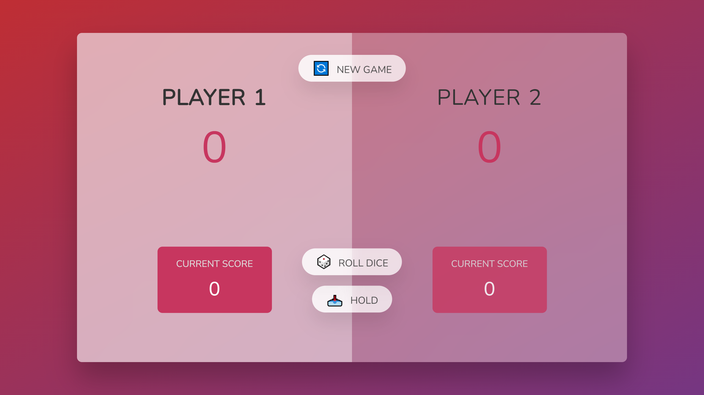

# Pig (Dice Game)

Pig is a simple dice game first described in print in John Scarne in 1945. Players take turns to roll a single dice as many times as they wish, adding all roll results to a running total, but losing their gained score for the turn if they roll a 1.

This Game Is Created Using HTML, CSS & JavaScript!

Find Me On :
[Facebook](https://www.facebook.com/NitinChakraborty2001/),
[Instagram](https://www.instagram.com/NitinChakraborty2001/),
[LinkedIn](https://www.linkedin.com/in/NitinChakraborty2001/),
[Twitter](https://www.twitter.com/NitinCB2001/),
[YouTube](http://www.youtube.com/c/NitinChakraborty2001/),
[Freelancer](https://www.freelancer.com/u/NitinCB2001/),
[Steam](https://steamcommunity.com/id/NitinChakraborty2001/),
[Twitch](https://www.twitch.tv/NitinChakraborty2001/).
